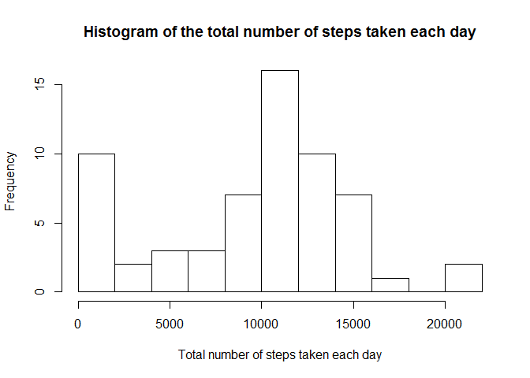
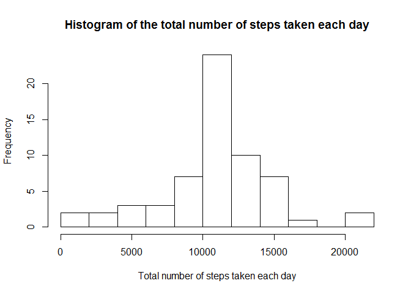
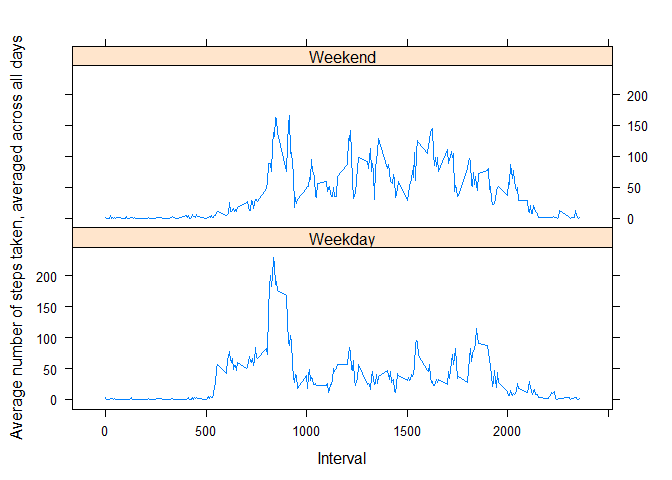

# Reproducible Research: Peer Assessment 1
## Pre-Steps
### -Download the data and unzip it from the given url. In case the url changes, replace it.

```r
#download and unzip data
data_url<-"https://d396qusza40orc.cloudfront.net/repdata%2Fdata%2Factivity.zip"

if(!file.exists("activity.zip")) 
        {download.file(data_url, destfile = "activity.zip",mode="wb")}

if(!file.exists("activity.csv"))
        {unzip("activity.zip","activity.csv")}
```

### -Call the libraries required for the next steps.

```r
#calling libraries
library(dplyr)
library(timeDate)
library(lattice)
```

## Loading and preprocessing the data

```r
data<-read.csv("activity.csv", stringsAsFactors = F)
```

### >The total number of steps taken per day is calculated as follows:
-dplyr functions are used to group the data by date then create a new data frame (steps.day) consisting of two columns; the date and the sum of steps.

```r
steps.day<-data %>%
        group_by(date) %>%
        summarise(steps.total=sum(steps,na.rm=TRUE))
```
-(steps.day) should contain values as follows:


```r
head(steps.day)
```

```
## Source: local data frame [6 x 2]
## 
##         date steps.total
##        (chr)       (int)
## 1 2012-10-01           0
## 2 2012-10-02         126
## 3 2012-10-03       11352
## 4 2012-10-04       12116
## 5 2012-10-05       13294
## 6 2012-10-06       15420
```
###>A histogram of the total number of steps taken each day (optional breaks=10) is created as follows:

```r
hist(steps.day$steps.total,breaks=10,xlab="Total number of steps taken each day",main="Histogram of the total number of steps taken each day")
```

\

### >The mean and median of the total number of steps taken per day are calculated as follows:


```r
steps.mean<-mean(steps.day$steps.total)
steps.median<-median(steps.day$steps.total)
```
-The mean and the median of the total number of steps taken per day are **9354.2295082** and **10395**.

## What is the average daily activity pattern?

### >A time series plot (i.e. type = "l") is made for the 5-minute interval (x-axis) and the average number of steps taken, averaged across all days (y-axis). 

-The data is first grouped by interval then the average number of steps is calculated for each interval. Then the average number of steps is plot versus the 5-minute interval.


```r
steps5<-data %>%
        group_by(interval) %>%
        summarise(average=mean(steps,na.rm=T))
```
-The time series is plotted as follows:


```r
plot(steps5$interval,steps5$average,type="l",xlab="Interval",ylab="Average number of steps")
```

\


### >The 5-minute interval, on average across all the days in the dataset, which contains the maximum number of steps is found as follows:


```r
interval.max<-steps5$interval[which.max(steps5$average)]
```
-The 5-minute interval that contains the maximum number of steps is **835**

## Imputing missing values

### >The total number of missing values in the dataset (i.e. the total number of rows with NAs) is found as follows:

```r
valuesNA<-sum(!(complete.cases(data)))
```
-The total number of missing values in the dataset (i.e. the total number of rows with NAs) = **2304** rows.

### >The missing values in the dataset are filled with the 5-minute-interval mean. This is one choice and the  mean/median for that day could also be used.

```r
#add a column to the original data with the values of the 5-minute-interval mean
data_mod<-data %>%
        group_by(interval) %>%
        mutate(average=mean(steps,na.rm=T))

#if the steps value is missing,use the values in the new column to fill in the missing values. Otherwise, keep the original value 
data_mod$steps <-ifelse(is.na(data_mod$steps),data_mod$average,data_mod$steps)
```

### >A new dataset is created that is equal to the original dataset but with the missing data filled in.

```r
data_new<-select(data_mod,-c(average))
```

### >A histogram is made of the total number of steps taken each day with the new data.


```r
steps.day2<-data_new %>%
        group_by(date) %>%
        summarise(steps.total=sum(steps,na.rm=T))

hist(steps.day2$steps.total,breaks=10,xlab="Total number of steps taken each day",main="Histogram of the total number of steps taken each day")
```

\

### >The mean and median total number of steps taken per day with the new data are calculated as follows:

```r
steps.mean2<-mean(steps.day2$steps.total)
steps.median2<-median(steps.day2$steps.total)
```

-The mean  and the median of the total number of steps taken per day after imputing the data are **1.0766189\times 10^{4}** and **1.0766189\times 10^{4}**


## Are there differences in activity patterns between weekdays and weekends?

### >A new factor variable is created in the dataset with two levels - "weekday" and "weekend"

```r
#add a new column to the new data indicating whether the day is a weekday/weekend
data_new$weekday<-as.factor(ifelse(isWeekday(data_new$date),"Weekday","Weekend"))
```

### >A panel plot is created containing a time series plot (i.e. type = "l") of the 5-minute interval (x-axis) and the average number of steps taken, averaged across all weekday days or weekend days (y-axis).
-This is similar to the previous time series. But the data is grouped by both interval and weekday to be able to seperate them in a panel plot as follows:

```r
weekdays_mean<-data_new %>%
        group_by(weekday,interval) %>%
        summarise(average=mean(steps))

xyplot(average~interval|factor(weekday),data=weekdays_mean,layout=c(1,2),type="l",xlab="Interval",ylab="Average number of steps taken, averaged across all days")
```

\
